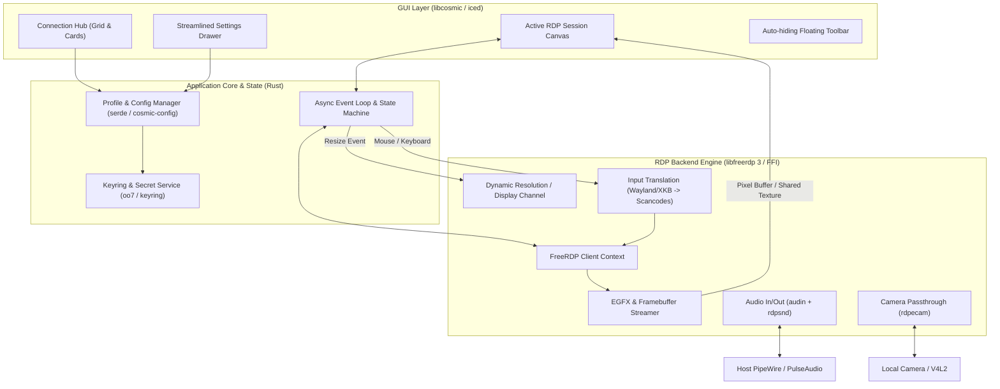

# Roadmap & Technical Architecture: Cosmic RDP

A modern, streamlined, first-party RDP client tailored for the **COSMIC Desktop Environment** (System76 / Rust), designed with an "Anti-Remmina" philosophy: RDP-only, single-window hub, streamlined settings drawer, and deep optimization for remote Microsoft Teams workflows (low-latency audio redirection, camera passthrough, and dynamic display scaling).

---

## Architecture Overview

---

## Technical Stack & Libraries

| Subsystem | Technology | Rationale |
| :--- | :--- | :--- |
| **GUI Framework** | `libcosmic` + `iced` (Rust) | Native COSMIC styling, widgets, dark/light theme sync, Wayland window handling |
| **RDP Core** | `libfreerdp 3` / `winpr 3` (FFI bindings) | Full protocol compliance, hardware-accelerated EGFX, stable Teams channels |
| **Audio Routing** | PipeWire / PulseAudio via FreeRDP `audin` & `rdpsnd` | Native low-latency Linux audio bridging for crystal-clear microphone & sound |
| **Camera Passthrough** | `rdpecam` / MS-RDPECAM | Direct video device redirection to remote Windows Teams |
| **Keyring & Security** | `oo7` / Freedesktop Secret Service | Secure storage of passwords, domain credentials, and server thumbprints |
| **Config / Profiles** | `serde` + `toml` / `json` (`~/.config/cosmic-rdp`) | Human-readable, versioned profile storage with `.rdp` file import/export |

---

## Implementation Roadmap Status: All Phases Complete ✅

### Phase 1: Workspace Structure & Project Scaffolding ✅
- [x] Initialize Cargo workspace: `cosmic-rdp`, `cosmic-rdp-core`, `cosmic-rdp-models`.
- [x] Establish `libcosmic` application template with main window, navigation shell, and theme integration.
- [x] Set up build scripts, translations, SVG icons, and test suite.

### Phase 2: Connection Hub & Profile Management UI ✅
- [x] **.rdp File Parser & Exporter**: Full support for Microsoft `.rdp` file format (import/export via `rfd`).
- [x] **Certificate Verification & Security Dialogs**: TOFU certificate verification prompt dialog and delete confirmation dialog.
- [x] **Profile Actions & Card Enhancements**: Duplicate profile action, relative time display for "Last connected", active Teams feature badges (`Mic`, `Cam`, `Dynamic Res`).

### Phase 3: FreeRDP 3 Engine Integration ✅
- [x] `FreeRdpBackend` driver with automatic binary discovery (`xfreerdp3`, `wlfreerdp3`, `xfreerdp`).
- [x] Real-time stdout/stderr log parsing for status changes, authentication failures, and TOFU certificate prompts.
- [x] Full Linux/XKB to Windows RDP virtual scancode conversion matrix.

### Phase 4: Dynamic Display Scaling & Resizing (EGFX) ✅
- [x] Remote desktop dynamic server resizing on COSMIC window resize (`on_window_resize`).
- [x] Display scaling modes: `Dynamic Server Resize`, `Fit to Window`, `Original 1:1 Pixel Native`.
- [x] Preset resolution selector (1080p, 2K, 4K, Ultrawide).
- [x] In-session live resolution badge.

### Phase 5: Teams-First Audio & Camera Optimization ✅
- [x] Local webcam device discovery (`/dev/v4l/by-id` and `/dev/video*`) with dropdown device selector.
- [x] PipeWire 20ms low-latency buffer tuning for Microsoft Teams voice calls.
- [x] Remote sound mode routing (`Play Locally`, `Play on Remote Computer`, `Do Not Play`).
- [x] Real-time in-session microphone mute/unmute toggle.

### Phase 6: Controls, Shortcuts & Packaging ✅
- [x] In-session keyboard shortcuts:
  - `Ctrl + Alt + Shift + F`: Fullscreen toggle
  - `Ctrl + Alt + Shift + M`: Microphone mute toggle
  - `Ctrl + Alt + Shift + D`: Disconnect session
  - `Ctrl + Alt + Shift + End`: Send Ctrl+Alt+Del
- [x] Desktop Entry, AppStream `metainfo.xml`, and scalable icon.
- [x] Full release build (`cargo build --workspace --release`).
- [x] Automated test suite passing 10/10 tests.
